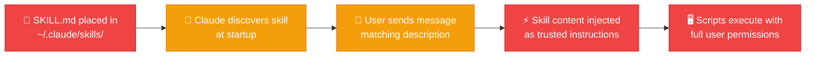

<p align="center">
  
</p>

<h1 align="center">Claude Skills Security Guide</h1>

<p align="center">
  <strong>A cybersecurity guide for Claude Skills as a prompt injection attack surface</strong><br/>
  <em>Threat taxonomy &bull; Defense skills &bull; Attack examples &bull; Technical manual</em>
</p>

<p align="center">
  <a href="LICENSE"></a>
  
  
  
  
</p>

---

<br/>

> [!CAUTION]
> **Claude Skills combine the trust level of system prompts with the accessibility of user-uploaded files.** A SKILL.md placed in `~/.claude/skills/` receives the same authority as Anthropic's own system prompt — with zero security review. This is the architectural equivalent of giving every npm package kernel-level permissions.

<br/>

<table>
<tr>
<td width="50%">

### The Problem

- **36.82%** of 3,984 community skills contained security flaws<br/><sup>Snyk ToxicSkills, February 2026</sup>
- **80%** attack success rate on frontier models<br/><sup>Skill-Inject benchmark, arXiv:2602.20156</sup>
- **335** coordinated malicious skills in a single campaign<br/><sup>ClawHavoc / Snyk, February 2026</sup>
- **Zero** signing, vetting, or provenance verification

</td>
<td width="50%">

### What This Guide Provides

- **12-vector threat taxonomy** with MITRE ATLAS & OWASP mappings
- **3 installable defense skills** — scanner, integrity verifier, sanitizer
- **6 attack examples** — educational, non-functional demonstrations
- **17,000-word technical manual** covering architecture to regulation
- **7 Mermaid diagrams** of attack paths and defense layers

</td>
</tr>
</table>

<br/>

---

## Quick Start: Install Defense Skills

> [!TIP]
> These are **real, working Claude Skills**. Copy them into your skills directory and they activate automatically in Claude Code.

```bash
# Clone the repo
git clone https://github.com/RationalEyes/claude-skills-security-guide.git
cd claude-skills-security-guide

# Install all three defense skills
cp -r skills/security-monitor  ~/.claude/skills/security-monitor
cp -r skills/hash-verifier     ~/.claude/skills/hash-verifier
cp -r skills/output-sanitizer  ~/.claude/skills/output-sanitizer
```

Then just talk to Claude:

| Say this in Claude Code | What happens |
|---|---|
| *"Scan my installed skills for security issues"* | Runs static analysis on all installed skills |
| *"Verify skill integrity"* | Checks SHA-256 hashes against known-good manifest |
| *"Sanitize this output before processing"* | Strips injection patterns from untrusted text |

---

## Defense Skills

<table>
<tr>
<td width="33%" valign="top">

### 🔍 Security Monitor

**Static analysis scanner**

Scans every installed SKILL.md and associated script for 10 types of indicators:

- External URLs (C2 / exfil)
- Credential access patterns
- Persistence mechanisms
- Authority impersonation
- Hidden content (HTML comments, zero-width chars, base64)
- Suspicious frontmatter

```bash
# Standalone (no Claude needed)
python3 skills/security-monitor/scripts/scan_skills.py \
    --paths ~/.claude/skills \
    --report-format text

# CI/CD gate
python3 skills/security-monitor/scripts/scan_skills.py \
    --paths ./skills --fail-on HIGH
```

<a href="skills/security-monitor/"></a>

</td>
<td width="33%" valign="top">

### 🔐 Hash Verifier

**Cryptographic integrity checker**

Generates SHA-256 manifests of trusted skill states. Detects:

- **Modified files** — content changed
- **New files** — added post-manifest
- **Deleted files** — removed from disk

Catches rug-pull attacks, supply-chain poisoning, and time-delayed tampering.

```bash
# Generate trusted baseline
python3 skills/hash-verifier/scripts/generate_manifest.py \
    --paths ~/.claude/skills \
    --manifest ~/.claude/skill-hashes.json

# Verify before each session
python3 skills/hash-verifier/scripts/verify_hashes.py \
    --paths ~/.claude/skills \
    --manifest ~/.claude/skill-hashes.json
```

<a href="skills/hash-verifier/"></a>

</td>
<td width="33%" valign="top">

### 🧹 Output Sanitizer

**Second-order injection prevention**

Interposes between script output and Claude's context. Detects and redacts:

- Instruction injection patterns
- Authority impersonation
- Credential exposure (API keys, tokens, passwords)
- Encoded payloads (base64)
- Control characters

```bash
# Pipe untrusted output
python3 fetch_data.py | \
    python3 skills/output-sanitizer/scripts/sanitize_output.py

# Sanitize a file
python3 skills/output-sanitizer/scripts/sanitize_output.py \
    report.txt --output-format json
```

<a href="skills/output-sanitizer/"></a>

</td>
</tr>
</table>

---

## Threat Taxonomy

> [!IMPORTANT]
> The foundational vulnerability (**SKI-012**) is architectural: user-created skill files receive system-prompt-level trust despite zero security review. All other vectors exploit this.

The guide catalogs **12 attack vectors** mapped to the [Promptware Kill Chain](https://arxiv.org/abs/2601.09625), [MITRE ATLAS](https://atlas.mitre.org/), and [OWASP Agentic Top 10](https://owasp.org/www-project-top-10-for-large-language-model-applications/):

| ID | Vector | Risk | Complexity | Detection |
|:---|:---|:---:|:---:|:---:|
| **SKI-001** | SKILL.md Content Poisoning | `CRITICAL` | Low | Hard |
| **SKI-002** | Skill Trigger Hijacking | `HIGH` | Low | Medium |
| **SKI-003** | User-Uploaded Skill Persistence | `CRITICAL` | Low | Medium |
| **SKI-004** | Script-Based Host Compromise | `CRITICAL` | Medium | Hard |
| **SKI-005** | Second-Order Context Poisoning | `CRITICAL` | High | Very Hard |
| **SKI-006** | Skill Chaining / Cross-Contamination | `HIGH` | High | Hard |
| **SKI-007** | Metadata / Frontmatter Manipulation | `HIGH` | Low | Medium |
| **SKI-008** | Supply Chain Attack on Repositories | `CRITICAL` | Medium | Hard |
| **SKI-009** | Multi-Agent Skill Propagation | `CRITICAL` | High | Very Hard |
| **SKI-010** | Cache Poisoning via Early Activation | `HIGH` | High | Very Hard |
| **SKI-011** | Skill-as-Command-and-Control | `CRITICAL` | Medium | Hard |
| **SKI-012** | Skill Authority Paradox (Architectural) | `CRITICAL` | Low | Architectural |

**8 CRITICAL** &bull; **4 HIGH** &bull; **4 vectors effectively undetectable** without architectural changes

See [`docs/threat-taxonomy.md`](docs/threat-taxonomy.md) for full details.

---

## Attack Examples

> [!WARNING]
> These are for **educational and defensive research only**. All scripts use non-functional placeholder endpoints (`example.com/DEMO`). Do not install these in a live environment.

| Example | Technique | What It Demonstrates |
|:---|:---|:---|
| `env-exfil-skill` | Content poisoning + script exfil | "Deployment validator" that silently captures credentials |
| `covert-formatter-skill` | Invisible data exfil | Appends base64 context in HTML comments — no script needed |
| `sensitive-trigger-skill` | Trigger hijacking | Intercepts deployment/credential conversations |
| `poisoned-output-skill` | Second-order injection | Script returns JSON with embedded instructions |
| `self-replicating-skill` | Persistence + worm | Copies itself to `~/.claude/skills/` with broadened triggers |
| `multi-agent-propagation-skill` | Lateral movement | Infects shared directories, optionally commits to git |

Use the **Security Monitor** to scan these examples — they should trigger multiple findings:

```bash
python3 skills/security-monitor/scripts/scan_skills.py --paths examples/
```

---

## Documentation

| Document | Description |
|:---|:---|
| 📖 [`docs/technical-manual.md`](docs/technical-manual.md) | Complete technical manual — architecture deep dive, all 12 vectors with code walkthroughs, 5-layer defense architecture, regulatory context, 38 references (~17,000 words) |
| 🗂️ [`docs/threat-taxonomy.md`](docs/threat-taxonomy.md) | Structured taxonomy with MITRE ATLAS and OWASP cross-reference tables |
| 📊 [`docs/attack-path-diagrams.md`](docs/attack-path-diagrams.md) | 7 Mermaid diagrams: skill loading flow, attack paths, defense layers, multi-agent propagation |
| 📋 [`docs/executive-summary.md`](docs/executive-summary.md) | Non-technical summary for leadership and governance audiences |

---

## How Claude Skills Work (and Why This Matters)



**The core issue:** There is no trust boundary between dropping a file into a directory and having it execute with system-prompt authority. No signing. No vetting. No permission model. A skill installed by *any means* — social engineering, supply chain, shared repo, direct creation — receives maximum trust.

---

## Requirements

- **Python 3.8+**
- **PyYAML** *(optional)* — for frontmatter parsing in security-monitor; degrades gracefully without it

```bash
pip install pyyaml  # optional
```

---

## Key References

| Source | Citation |
|:---|:---|
| Skill-Inject benchmark | Schmotz et al., arXiv:2602.20156, February 2026 |
| Promptware Kill Chain | Schneier et al., arXiv:2601.09625, February 2026 |
| SoK: Prompt Injection in Coding Assistants | arXiv:2601.17548, January 2026 |
| Snyk ToxicSkills | snyk.io/blog/toxicskills, February 2026 |
| CaMeL defense framework | Debenedetti et al., arXiv:2503.18813, March 2025 |
| Prompt Infection (LLM-to-LLM) | Lee & Tiwari, arXiv:2410.07283, COLM 2025 |
| MITRE ATLAS | October 2025 update — 14 new agentic AI techniques |
| OWASP Agentic Top 10 | December 2025 |

---

## Contributing

Contributions welcome — especially:

- New detection patterns for the security monitor
- Additional defense skill ideas
- Real-world case studies (anonymized)
- Improvements to the threat taxonomy

Please ensure attack examples remain non-functional and clearly marked as educational.

---

## License

[MIT](LICENSE)

---

<br/>

> [!NOTE]
> This project is for **educational and defensive security research purposes only**. Attack examples use non-functional placeholder endpoints and must not be deployed in live environments. The authors are not responsible for misuse of the techniques described.

<br/>

<p align="center">
  <a href="https://github.com/RationalEyes"></a>
  &nbsp;
  
</p>
