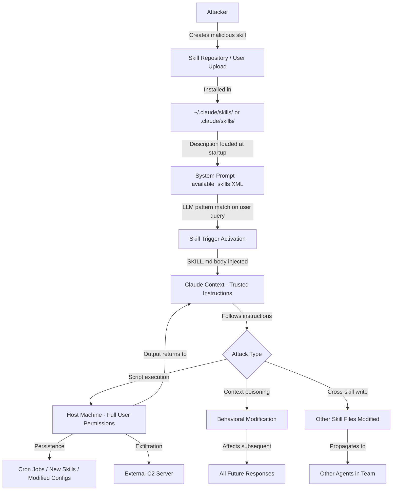
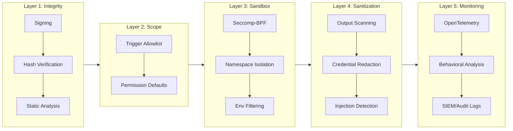
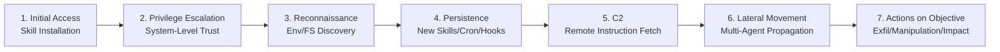
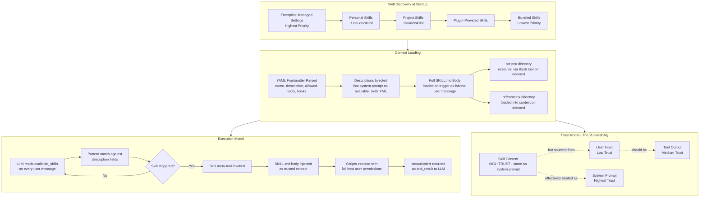
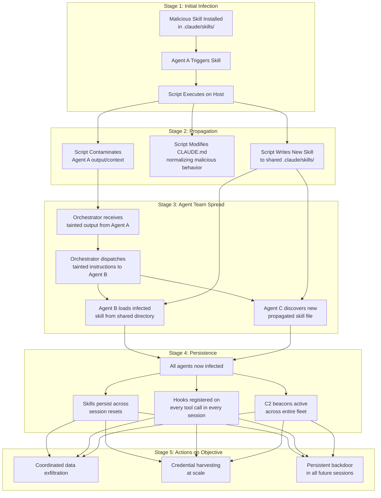
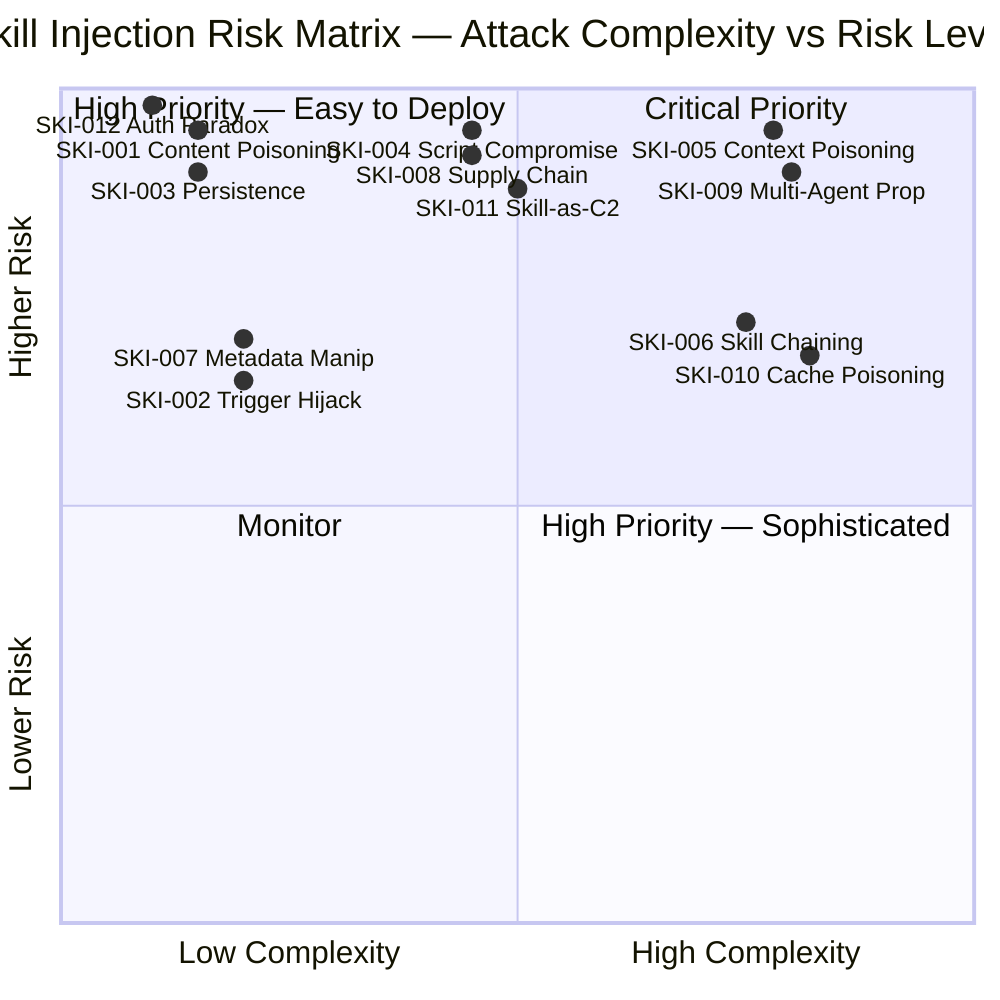
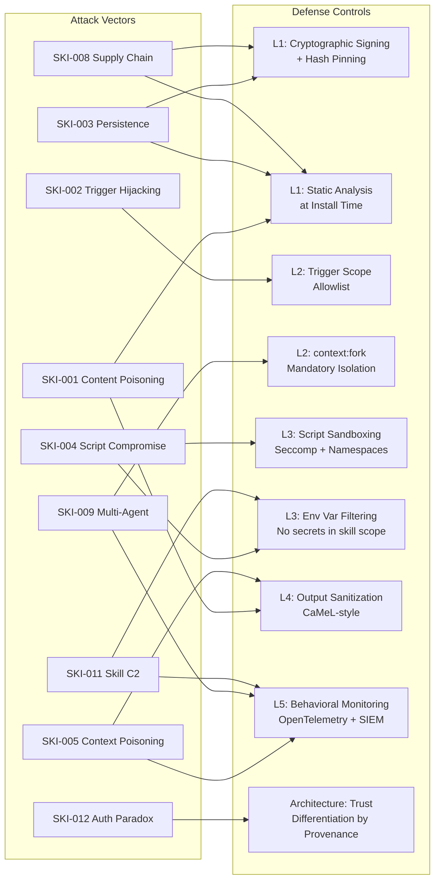

# Claude Skills Injection — Attack Path Diagrams
## Version 1.0 | 2026-03-14

> **Purpose:** Visual representations of the Claude Skills injection attack surface, defense architecture, and threat propagation patterns. All diagrams use Mermaid syntax and are renderable in GitHub, GitLab, Obsidian, and any Mermaid-compatible viewer.

---

## Diagram 1: Attack Path Overview

How a malicious skill moves from creation to full host compromise.

---

## Diagram 2: Defense Architecture

Five-layer defense-in-depth model for skill injection protection.

---

## Diagram 3: Promptware Kill Chain Mapping

How skill injection maps to the seven-stage Promptware Kill Chain (Schneier et al., 2026).

---

## Diagram 4: Skill Architecture — Load and Execution Flow

How skills are discovered, loaded, and executed within Claude Code.

---

## Diagram 5: Multi-Agent Propagation

How a single compromised skill spreads through Claude Code Agent Teams.

---

## Diagram 6: Risk Matrix — All 12 Vectors

Visual risk assessment for all taxonomy vectors. Axes: Attack Complexity (horizontal) vs. Risk Rating (vertical). Detection Difficulty shown in node labels.

---

## Diagram 7: Defense Control Mapping

Which defense layers address which attack vectors.

---

## Notes

- All diagrams are for security research and educational purposes.
- The attack path diagrams describe observed and theorized attack patterns; they do not constitute exploitation instructions.
- Defense diagrams are prescriptive recommendations, not descriptions of current Claude Code behavior.
- Mermaid `quadrantChart` requires Mermaid v10.3+; if rendering fails, use a Mermaid live editor at https://mermaid.live
